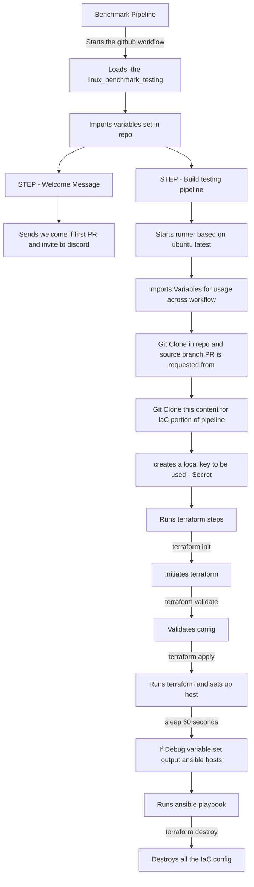

# Github linux IaC

terraform workflow files for use with the LE linux based pipelines

## Requirements

Each repo needs to have the following variables set
repository variables required - settings/actions/variables

- OSVARS = OS TYPE for benchmark
- Benchmark_type = Type of benchmark (CIS or STIG)

eg.

```shell
OSVARS RHEL9
BENCHMARK_TYPE CIS
```

## Overview

This is called by the repository workflow to pull in this content.
This enables us to manage the workflow and IAC centrally, enabling us to quickly change anything for improvements of issues with a certain region.



# Run locally

```shell
$ export benchmark_type="CIS"
$ export OSVAR="RHEL8"
$ export TF_VAR_repository="${OSVAR}-${benchmark_type}"
$ export TF_VAR_benchmark_type="${benchmark_type}"

$ terraform apply -var-file "github_vars.tfvars" -var-file "${OSVAR}.tfvars"
$ terraform destroy -var-file "github_vars.tfvars" -var-file "${OSVAR}.tfvars"
```
