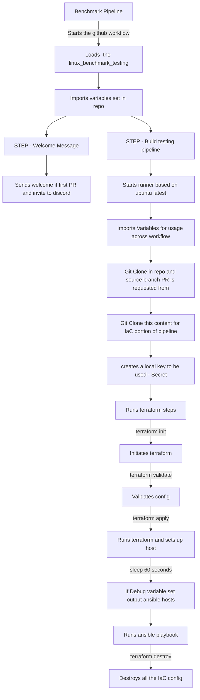
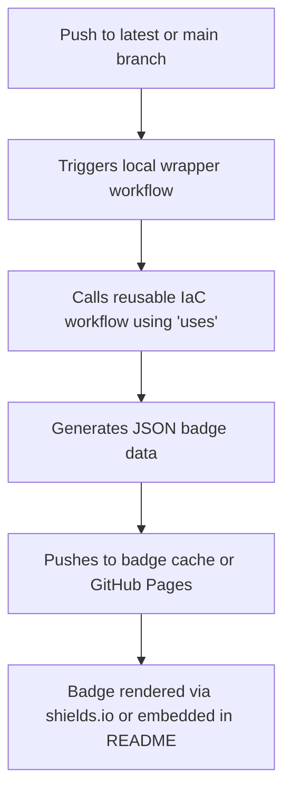
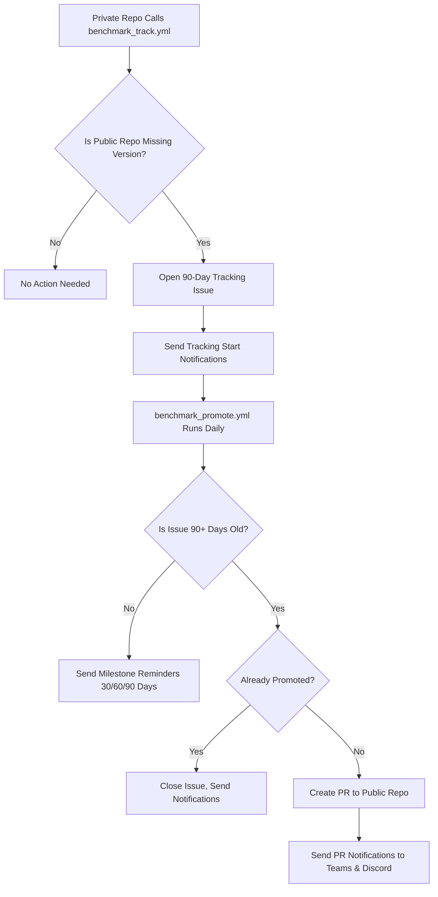
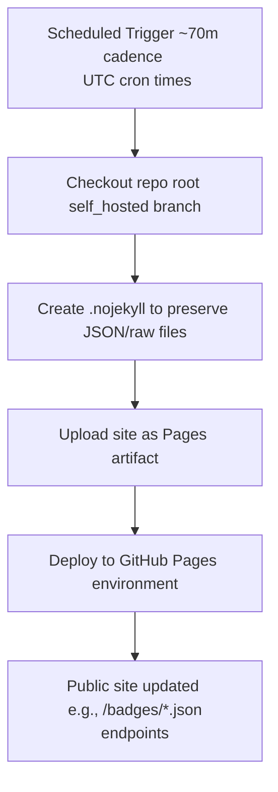

# GitHub Linux IaC

Infrastructure as Code (IaC) modules and automation for use with the Lockdown Enterprise (LE) Linux-based pipelines.
This central repository supports Linux benchmarking, deployment automation, and security hardening for CI workflows using Terraform (OpenTofu) and Ansible.

---

## 📚 Table of Contents

1. [📦 Features](#1-📦-features)
2. [🔐 Required Secrets](#2-️required-secrets)
3. [📘 Repository Variables (Required)](#3-️repository-variables-required)
4. [🏗️ IaC Modules](#4-️iac-modules)
5. [🧪 Pipeline Validation](#5-️pipeline-validation)
6. [🧪 Pipeline Validation Workflows](#6-️pipeline-validation-workflows)
   - [6.1 🧼 Standard Benchmark Validation](#61-️standard-benchmark-validation)
     - [6.1.1 Trigger Files](#611-trigger-files)
   - [6.2 📈 Workflow Matrix](#63-️workflow-matrix)
     - [6.2.1 🧪 Example Workflow Usage](#631-️example-workflow-usage)
       - [6.2.1.1 🔧 main_pipeline_validation.yml](#6311--main_pipeline_validationyml)
       - [6.2.1.2 🧪 devel_pipeline_validation.yml](#6313--devel_pipeline_validationyml)
7. [🖥️ Run Locally (Test Terraform + Ansible)](#7-️run-locally-test-terraform--ansible)
8. [🔁 Reusable GitHub Actions Workflows](#8-️reusable-github-actions-workflows)
   - [8.1 📂 Available Shared Workflows](#81-available-shared-workflows)
   - [8.2 🧩 Usage in Benchmark Repositories](#82-usage-in-benchmark-repositories)
   - [8.3 🔒 Badge Secret Note](#83-badge-secret-note)
   - [8.4 🧭 Workflow Flow](#84-workflow-flow)
9. [🏷️ Badge Types and Their Sources](#9-️badge-types-and-their-sources)
   - [9.1 🧷 Recommended Badge Format](#91-recommended-badge-format)
   - [9.2 🧰 Badge Integration Guidance](#92-badge-integration-guidance)
   - [9.3 ✅ Recommended Placement in README.md](#93-recommended-placement-in-readmemd)
10. [📈 Benchmark Tracker & Teams/Discord Notifications](#10-️benchmark-tracker--teamsdiscord-notifications)
    - [10.1 🧩 Workflow Files](#101-️workflow-files)
    - [10.2 🔐 Required Secrets](#102-️required-secrets)
    - [10.3 📝 Setup Checklist](#103-setup-checklist)
    - [10.4 📘 Additional Notes](#104-additional-notes)
11. [🔍 Benchmark Tracker Workflow Details](#11-️benchmark-tracker-workflow-details)
    - [11.1 📜 benchmark-tracker Workflow](#111--benchmark-tracker-workflow)
    - [11.2 ⏱ monitor-90day-promotions Workflow](#112--monitor-90day-promotions-workflow)
    - [11.3 🛠️ Code Highlights](#113-️code-highlights)
    - [11.4 🛠️ How the Tracker System Works](#114-️how-the-tracker-system-works)
12. [💬 Notification Examples](#12-️notification-examples)
13. [🐧 Windows Benchmark Badge Support](#13-️linux-benchmark-badge-support)
14. [📄 GitHub Pages Deploy (~70m cadence)](#14--github-pages-deploy-70m-cadence)

---

## 1. 📦 Features
- Centralized IaC logic for all Linux benchmark pipelines (CIS/STIG)
- Dynamic provisioning of Linux runners using OpenTofu
- Self-hosted runner workflows with automatic Terraform + Ansible flow
- Profile variant testing (e.g., `RHEL10`)
- Discord onboarding notifications for first-time contributors
- Shared GitHub Actions workflows for badge export and testing
- Support for local testing of IaC outside GitHub Actions

---

## 2. 🔐 Required Secrets (Required)

These secrets must be configured under `Settings → Secrets and variables → Actions` (repo or org level).
Private repos will need to be configured in the individual repos because the org secrets
do not function in private on our current plan.

| Secret Name               | Description                                                                 |
|---------------------------|-----------------------------------------------------------------------------|
| `AWS_ACCESS_KEY_ID`       | AWS access key ID for programmatic access                                   |
| `AWS_SECRET_ACCESS_KEY`   | AWS secret access key for programmatic access                               |
| `AWS_ASSUME_ROLE`         | AWS IAM Role to assume for provisioning                                     |
| `AWS_ROLE_SESSION`        | AWS session name                                                            |
| `AWS_PRIVSUBNET_ID`       | AWS private subnet ID for EC2 provisioning                                  |
| `AWS_VPC_SECGRP_ID`       | AWS security group ID                                                        |
| `BADGE_PUSH_TOKEN`        | GitHub token for pushing badge updates to GitHub Pages or badge repo         |
| `GALAXY_API_KEY`          | API key for publishing to Ansible Galaxy                                    |
| `SSH_PRV_KEY`             | Private SSH key for connecting to provisioned Linux instances               |

---

## 3. 📘 Repository Variables (Required)

These must be added under `Settings → Actions → Variables` in benchmark repos (e.g., `Linux-RHEL9-CIS`):

| Variable Name              | Description                                                      | Example        |
|----------------------------|------------------------------------------------------------------|----------------|
| `ANSIBLE_RUNNER_VERSION`   | Version of Ansible used by the CI runner                         | `2.16.6`       |
| `BENCHMARK_TYPE`           | Benchmark under test (`CIS`, `STIG`, etc.)                       | `CIS`          |
| `BUILD_SLEEPTIME`          | Seconds to wait before Ansible run after provisioning            | `90`           |
| `ENABLE_DEBUG`             | Enable debug output and disable auto-destroy (`true/false`)      | `false`        |
| `IAC_BRANCH`               | GitHub branch to load IaC modules from                           | `self_hosted`  |
| `OSVAR`                    | OS tfvars file base name (e.g., `UBUNTU20`, `RHEL9`)              | `UBUNTU20`     |

---

## 4. 🏗️ IaC Modules

This repo uses [OpenTofu](https://opentofu.org/) to provision Windows test runners locally or inside GitHub Actions for compliance validation.

### Terraform Files

| File            | Description                                                                    |
|-----------------|--------------------------------------------------------------------------------|
| `main.tf`       | Creates AWS-based Linux VMs with required networking and provisioning logic    |
| `vars.tf`       | Defines all input variables used by the main Terraform plan                    |
| `RHEL9.tfvars`  | Variable file for standard RHEL 9 runner setup                                  |
| `UBUNTU20.tfvars` | Variable file for standard Ubuntu 20.04 runner setup                          |

---

## 5. 🧪 Pipeline Validation

This repository supports automated validation pipelines that run on every push to `main` or `devel` branches of Linuxs benchmark repositories. These workflows are split by purpose:

- Standard validation (`main_pipeline_validation.yml`, `devel_pipeline_validation.yml`)

---

## 6. 🧪 Pipeline Validation Workflows

### 6.1 🧼 Standard Benchmark Validation (Linux)

Provision → Apply → Validate → Destroy

These workflows provision a fresh **Linux** environment (e.g., RHEL, Ubuntu) in AWS using OpenTofu/Terraform, apply the benchmark with Ansible, and validate compliance.

#### 6.1.1 Trigger Files:
- `.github/workflows/main_pipeline_validation.yml`
- `.github/workflows/devel_pipeline_validation.yml`


```mermaid
   graph TD;
    A[Benchmark Pipeline] -->|Starts the github workflow|B[Loads  the linux_benchmark_testing]
    B --> C[Imports variables set in repo]
    C --> D[STEP - Welcome Message]
    D --> E[Sends welcome if first PR and invite to discord]
    C --> F[STEP - Build testing pipeline]
    F --> G[Starts runner based on ubuntu latest]
    G --> H[Imports Variables for usage across workflow]
    H --> I[Git Clone in repo and source branch PR is requested from]
    I --> J[Git Clone this content for IaC portion of pipeline]
    J --> K[creates a local key to be used - Secret]
    K --> L[Runs terraform steps]
    L -->|terraform init|M[Initiates terraform]
    M -->|terraform validate|N[Validates config]
    N -->|terraform apply|O[Runs terraform and sets up host]
    O -->|sleep 60 seconds|P[If Debug variable set output ansible hosts]
    P --> Q[Runs ansible playbook] --> |terraform destroy|R[Destroys all the IaC config]
```

### 6.2 🧼 Standard Benchmark Validation – Linux

Provision → Apply → Validate → Destroy

These workflows provision a fresh **Linux** environment (e.g., RHEL, Ubuntu) in AWS using **OpenTofu** and Ansible. They are designed for both CLI-driven and UI-triggered execution in GitHub Actions. Once provisioned, the benchmark is applied, validated, and then the environment is destroyed (unless `ENABLE_DEBUG` is set to `true`).

---

## 6.2.1 🧪 Example Workflow Usage

These workflows are automatically triggered, but you can simulate them via PRs.

### 6.2.1.1 🔧 main_pipeline_validation.yml
```bash
# Triggers on PR to main/latest
# Uses: ${OSVAR}.tfvars
```

### 6.2.1.2 🧪 devel_pipeline_validation.yml
```bash
# Triggers on PR to devel or any 'benchmark_*' branch
# Uses: ${OSVAR}.tfvars
```
---

## 7. 🖥️ Run Locally (Test Terraform + Ansible)

```bash
export BENCHMARK_TYPE="CIS"
export OSVAR="WIN2022"
export TF_VAR_repository="${OSVAR}-${BENCHMARK_TYPE}"
export TF_VAR_BENCHMARK_TYPE="${BENCHMARK_TYPE}"

terraform init
terraform validate
terraform apply -var-file="UBUNTU22.tfvars" --auto-approve
terraform destroy -var-file="UBUNTU22.tfvars" --auto-approve
```

---

## 8. 🔁 Reusable GitHub Actions Workflows

This repository (`github_linux_IaC`) maintains **shared GitHub Actions workflows** that are reused by Windows benchmark repos to manage badge exports and automation logic.

### 8.1 📂 Available Shared Workflows

| Workflow Filename                | Purpose                                       |
|----------------------------------|-----------------------------------------------|
| `.github/workflows/export_badges_private.yml` | Used in **private** repos for badge JSON export |
| `.github/workflows/export_badges_public.yml`  | Used in **public** repos for shields.io badge endpoints |

### 8.2 🧩 Usage in Benchmark Repositories

Benchmark repos include a wrapper workflow like:

```yaml
# .github/workflows/export_badges_private.yml
name: Export Badges to Private Repo
on:
  push:
    branches: [ latest ]
jobs:
  export-badges:
    uses: ansible-lockdown/github_linux_IaC/.github/workflows/export_badges_private.yml@main
    secrets:
      GH_TOKEN: ${{ secrets.GITHUB_TOKEN }}
      BADGE_PUSH_TOKEN: ${{ secrets.BADGE_PUSH_TOKEN }}
```

> The reusable logic lives in the `github_linux_IaC` repo. This makes badge generation portable and consistent.

---

### 8.3 🔒 Badge Secret Note

| Secret Name        | Where Needed   | Notes                                                              |
|--------------------|----------------|---------------------------------------------------------------------|
| `BADGE_PUSH_TOKEN` | 🔒 Private Repos | Must be set **manually** even if it exists at the org level         |
| `GH_TOKEN`         | All repos       | Provided automatically by GitHub Actions                           |

---

### 8.4 🧭 Workflow Flow


```mermaid
graph TD;
  A[Push to latest or main branch] --> B[Triggers local wrapper workflow]
  B --> C[Calls reusable IaC workflow using 'uses']
  C --> D[Generates JSON badge data]
  D --> E[Pushes to badge cache or GitHub Pages]
  E --> F[Badge rendered via shields.io or embedded in README]
```

---

## 9. 🏷️ Badge Types and Their Sources

This repository supports a wide variety of badges across **public** and **private** benchmark repositories. These badges serve different purposes and come from different systems.

| Badge Type                    | Source System                  | Example Badge | Notes |
|------------------------------|--------------------------------|----------------|-------|
| **GitHub Stats (Stars/Forks)** | GitHub (static links)         |  | Hardcoded to specific repo/org |
| **Twitter & Discord**        | External services              |  | Hardcoded link or ID |
| **License Badge**            | GitHub                        |  | Hardcoded, dynamic on GitHub |
| **Lint Tools (yamllint, ansible-lint)** | Hardcoded manually            |  | Always present (not dynamic) |
| **GitHub Actions Status**    | GitHub Workflow Badge URLs     | [](https://github.com/ansible-lockdown/UBUNTU24-CIS/actions/workflows/main_pipeline_validation.yml) | Dynamic, GitHub-managed |
| **Commits, Issues, PRs**     | GitHub                         |  | Dynamic, GitHub-managed |
| **Pre-Commit CI**            | IaC Badge JSON (hosted)        | [](https://results.pre-commit.ci/latest/github/ansible-lockdownUBUNTU24-CIS/devel) | 🔄 Updated via IaC workflow |
| **Benchmark Version Badges** | IaC Badge JSON                 |  | 🔄 Dynamic IaC badge |
| **Private Repo Badges**      | IaC Badge JSON                 |  | 🔐 Internal subscribers only |
| **Release Branch**           | Hardcoded or IaC badge         |  / IaC endpoint | Sometimes manually added |

---

## 9.1 🧷 Recommended Badge Format

```markdown
[](https://results.pre-commit.ci/latest/github/ansible-lockdown/UBUNTU24-CIS/devel)
```
---

## 9.2 🧰 Badge Integration Guidance

- **Dynamic badges** use `.json` files hosted in the `github_linux_IaC` `badges/` folder.
- They are updated using the [`export_badges_public.yml`](https://github.com/ansible-lockdown/github_linux_IaC/blob/main/.github/workflows/export_badges_public.yml) and `export_badges_private.yml` workflows.
- Public repos use pre-built shields.io URLs.
- Private repos consume the same badge format but must manually set the `BADGE_PUSH_TOKEN`.

---

## 9.3 ✅ Recommended Placement in README.md

You can structure your badge sections like this:

```markdown
## Public Repository 📣


[](...)

[](...)
...

## Subscriber Release Information 🔐


[](...)
...
```

---

## 10. 📈 Benchmark Tracker & Teams/Discord Notifications

The `github_windows_IaC` repository contains a shared workflow system that automates **benchmark version tracking** across private repositories. Once a benchmark reaches 90 days in a private repo, it is eligible for **auto-promotion** to its corresponding public repository. Notifications are sent via **Microsoft Teams** and **Discord**.

---

### 10.1 🧩 Workflow Files

| Workflow File                  | Description                                                                 |
|-------------------------------|-----------------------------------------------------------------------------|
| `benchmark_track.yml`         | Called by private repos to initiate tracking. Determines if a benchmark version is missing from the public repo, and opens a 90-day issue if so. Sends Teams and Discord notifications. |
| `benchmark_promote.yml`       | Called daily from a central repo. Monitors all tracking issues. If 90+ days old, closes issues (if already promoted) or auto-creates PRs. Sends milestone reminders and promotion alerts. |

---

### 10.2 🔐 Required Secrets

These secrets **must** be configured in the GitHub repositories involved:

| Secret Name            | Scope              | Purpose                                                                 |
|------------------------|---------------------|-------------------------------------------------------------------------|
| `GH_TOKEN`             | All repos           | Required for GitHub CLI operations (issues, PRs, comments, etc.)        |
| `TEAMS_WEBHOOK_URL`    | All repos           | Used to send Adaptive Card notifications to Microsoft Teams             |
| `DISCORD_WEBHOOK_URL`  | All repos           | Sends milestone, promotion, and closure alerts to Discord channels      |
| `BADGE_PUSH_TOKEN`     | All repos           | Grants write access to push badge files to `github_windows_IaC`        |

> Add these under: `Settings → Secrets → Actions` for each participating repository.

---

# 📝 10.3 Setup Checklist

Set the required secrets in each **Private** repo:

- `GH_TOKEN`
- `TEAMS_WEBHOOK_URL`
- `DISCORD_WEBHOOK_URL`
- `BADGE_PUSH_TOKEN`

**Private Repo:**
- Call `benchmark_track.yml` from PR merges or scheduled runs.

**IaC Repo:**
- Schedule `benchmark_promote.yml` to run daily.

**Public Repo:**
- Ensure `devel` branch and `README.md` exist to validate versions.

**Teams/Discord Webhooks:**
- Ensure your automation supports HTTP POST with full JSON payloads.

---

## 📘 10.4 Additional Notes

- Benchmarks must follow naming conventions (`Private-Linux-*` → `Ubuntu-*`).
- `README.md` format must include a recognizable version string (e.g., `vX.Y.Z` or `Version X, Rel Y`).
- All workflows are modular and intended to be reused across repos.
- Discord support is now included in all milestones and promotion actions.

> ✅ This setup ensures full traceability and timely promotion of compliance benchmarks while keeping all stakeholders informed.

---

## 11 🔍 Benchmark Tracker Workflow Details

### 11.1 📜 `benchmark-tracker` Workflow

Triggered when a pull request from a branch matching `benchmark_*` is merged into the `latest` branch of a **Private** repo.

#### 🔄 What it does:

1. **Extract version from PR branch name**
   Example: `benchmark_v2.0.0` becomes `v2.0.0`
2. **Create a GitHub issue** in the same repo with a 90-day countdown
3. **Assign labels**, version tags, and metadata to the issue
4. **Post a confirmation comment** in the PR for traceability

This tracks the need to promote this version publicly after 90 days.

---

### 11.2 ⏱ `monitor-90day-promotions` Workflow

Runs daily from the **IaC repo**. Monitors issues created by the tracker workflow.

#### 🔄 What it does:

1. **Scan all private repos** for open issues labeled as benchmark trackers
2. **Parse the issue body** to extract the version, repo name, and date created
3. **Calculate the age of each issue**
4. If the issue is **older than 90 days**:
   - Clones the corresponding **public repo**
   - Creates a PR to add the benchmark version to the `main` branch
   - Uses `gh pr create` and `gh pr merge` to automate promotion
   - Pushes new badge files to `github_windows_IaC`
   - Sends a **Teams notification** with summary info
   - Closes the original issue with a comment

> If the issue is **not** yet 90 days old, it is skipped and checked again on the next scheduled run.

---

### 11.3 🛠️ Code Highlights

Each step is modularized inside the workflow YAML:

- `benchmark-tracker.yml`
  - `- name: Detect PR branch and extract version`
  - `- name: Create 90-day tracking issue`
  - `- name: Label and annotate PR`
- `monitor-90day-promotions.yml`
  - `- name: Search for benchmark tracker issues`
  - `- name: Compare age against 90-day threshold`
  - `- name: Promote version if qualified`
  - `- name: Send Teams notification via webhook`
  - `- name: Update badge JSON in IaC`

---

### 11.4 🛠️ How the Tracker System Works


```mermaid
graph TD;
  A[Private Repo Calls benchmark_track.yml] --> B{Is Public Repo Missing Version?}
  B -- No --> C[No Action Needed]
  B -- Yes --> D[Open 90-Day Tracking Issue]
  D --> E[Send Tracking Start Notifications]
  E --> F[benchmark_promote.yml Runs Daily]
  F --> G{Is Issue 90+ Days Old?}
  G -- No --> H[Send Milestone Reminders 30/60/90 Days]
  G -- Yes --> I{Already Promoted?}
  I -- Yes --> J[Close Issue, Send Notifications]
  I -- No --> K[Create PR to Public Repo]
  K --> L[Send PR Notifications to Teams & Discord]
```

---

### 12. 💬 Notification Examples

The system supports **Teams** and **Discord** alerts for all key events during benchmark tracking and promotion. These include:

- ✅ Tracking Started
- 🚨 Public Repo Missing
- ⏰ Milestone Reminders (30, 60, 90 days)
- ⚠️ Overdue Warnings
- ✅ Already Promoted Notices
- ❌ Promotion Blocked Alerts
- 🚨 Auto-Promotion PR Created

Each message is customized for Teams and Discord formatting, with links to issues and PRs where applicable.

---

#### ✅ Tracking Started — Teams
```markdown
🚀 Tracking Initiated - v2.0.0
🔒 Subscriber Repo: ansible-lockdown/Private-Windows-2022-CIS
📦 Subscriber Version: v2.0.0
🌐 Community Target: ansible-lockdown/Windows-2022-CIS
📦 Community Version: v1.9.0
⏳ Subscriber Review Ends: Approx: 2025-09-07
🗓️ Auto-Promotion Date To Community: Approx: 2025-09-12
📅 Promotion In: 90 days
```

#### 🚨 Public Repo Missing — Teams
```markdown
🚨 Tracking Started — But There's A Problem 🚨
Benchmark version 'v2.0.0' from **Private-Windows-2022-CIS** has entered the 90-day window.
⚠️ However, the public repo **Windows-2022-CIS** is missing or incomplete.
📢 Please create and prepare the community repo.
```

#### ✅ Tracking Started — Discord
```markdown
🚀 Benchmark Release To Community Tracking Started
🔒 Subscriber Repo: ansible-lockdown/Private-Windows-2022-CIS
📦 Subscriber Version: v2.0.0
🌐 Community Repo: ansible-lockdown/Windows-2022-CIS
📦 Community Version: v1.9.0
⏳ Review Ends: 2025-09-07
🗓️ Auto-Promotion Date: 2025-09-12
```

#### ⏰ 30/60/90 Day Reminder — Discord
```markdown
⏰ Benchmark Promotion Milestone
📢 60-Day Reminder: Benchmark `v2.0.0` is scheduled for promotion in 30 days.
⚠️ If not promoted manually, auto-promotion occurs on Day 95.
🔒 Subscriber Repo: Private-Windows-2022-CIS
📦 Version: v2.0.0
🌐 Target: Windows-2022-CIS
⏱️ Days Tracked: 60
📆 Scheduled Auto-Promotion: 2025-09-12
```

#### ⚠️ Overdue Reminder — Teams
```markdown
⏰ Benchmark Promotion Reminder
⚠️ Benchmark v2.0.0 from `Private-Windows-2022-CIS` is overdue by 3 days.
⏲️ Auto-promotion will occur in 2 days.
🔗 View Issue #43
```

#### ✅ Already Promoted — Teams
```markdown
✅ Benchmark Already Promoted
Benchmark version v2.0.0 is already in Windows-2022-CIS.
📅 Auto-closed on: 2025-09-05
🔗 View Issue #43
```

#### ✅ Already Promoted — Discord
```markdown
✅ Benchmark Promoted To Community
Benchmark v2.0.0 from `Private-Windows-2022-CIS` is already in `Windows-2022-CIS`
🌿 Branch: devel
📅 Auto-closed: 2025-09-05
🔗 Issue: View Issue #43
```

#### ❌ Promotion Blocked — Teams
```markdown
❌ Benchmark Promotion Will Be Blocked
🚫 The community repo **Windows-2022-CIS** does not exist or is missing `devel`.
📢 Please resolve this to enable promotion.
🔒 Repo: Private-Windows-2022-CIS
📦 Version: v2.0.0
```

#### 🚨 Auto-Promotion PR Created — Teams
```markdown
🚨 Benchmark PR Automatically Created 🚨
Version v2.0.0 from Private-Windows-2022-CIS has been proposed for promotion.
🔗 PR: https://github.com/ansible-lockdown/Windows-2022-CIS/pull/99
📅 Days Tracked: 95
🔄 Branch: promote_benchmark_v2_0_0
```

#### 📦 Auto-Promotion PR Created — Discord
```markdown
📦 Benchmark Promotion PR Created: Promote v2.0.0
🔒 Repo: Private-Windows-2022-CIS
🌐 Target: Windows-2022-CIS
🌿 Branch: [promote_benchmark_v2_0_0](https://github.com/ansible-lockdown/Windows-2022-CIS/tree/promote_benchmark_v2_0_0)
🔗 PR: https://github.com/ansible-lockdown/Windows-2022-CIS/pull/99
📅 Days Tracked: 95
```
---

### 13. 🐧 Windows Benchmark Badge Support

This Windows IaC repository also acts as the **central badge hub** for Windows-based benchmark pipelines.

- All badge JSON files for **Linux CIS** and **Linux STIG** benchmarks are written to the `badges/` directory in this repo
- The same export workflows (`export_badges_public.yml`, `export_badges_private.yml`) handle both **Windows** and **Linux** badge publication
- Example: A benchmark like `Windows-2022-CIS` will have badges stored at:

```
https://ansible-lockdown.github.io/github_windows_IaC/badges/Windows-2022-CIS/pre-commit-ci.json
```

> This keeps badge generation consistent and centralized across all platforms for Lockdown.

---

### 14. 📄 GitHub Pages Deploy (~70m cadence)

This repository includes a **scheduled GitHub Pages deployment** workflow (`.github/workflows/pages_deploy.yml`) that publishes the **entire repo root** to GitHub Pages on a ~70-minute cadence, with one intentional long gap per day.

**Key Details:**
- **Purpose:** Push updated site content (including `/badges/*.json`) to GitHub Pages.
- **Cadence:** Runs ~every 70 minutes, except for a ~110-minute gap overnight in the Eastern Time zone.
- **Gap Placement:** UTC schedule is arranged so the long gap (~03:10–05:00 UTC) corresponds to ~11:10 pm–1:00 am ET during Daylight Saving Time.
- **.nojekyll:** Ensures raw JSON endpoints and other non-Jekyll assets are served correctly.
- **Concurrency:** Deploy jobs are never canceled once started, preventing partial publishes.

#### Mermaid Workflow Diagram


```mermaid
flowchart TD
    A[Scheduled Trigger ~70m cadence \n UTC cron times] --> B[Checkout repo root self_hosted branch]
    B --> C[Create .nojekyll to preserve JSON/raw files]
    C --> D[Upload site as Pages artifact]
    D --> E[Deploy to GitHub Pages environment]
    E --> F[Public site updated \n e.g., /badges/*.json endpoints]
```

#### Cron Schedule Overview

| UTC Time(s)              | Approx. ET Time(s)*           | Notes             |
|--------------------------|-------------------------------|-------------------|
| `02:00, 05:00, 12:00, 19:00` | 10:00 pm, 1:00 am, 8:00 am, 3:00 pm | Major deploys     |
| `03:10, 06:10, 13:10, 20:10` | 11:10 pm, 2:10 am, 9:10 am, 4:10 pm | Staggered deploys |
| `07:20, 14:20, 21:20`        | 3:20 am, 10:20 am, 5:20 pm          | Staggered deploys |
| `08:30, 15:30, 22:30`        | 4:30 am, 11:30 am, 6:30 pm          | Staggered deploys |
| `09:40, 16:40, 23:40`        | 5:40 am, 12:40 pm, 7:40 pm          | Staggered deploys |
| `00:50, 10:50, 17:50`        | 8:50 pm, 6:50 am, 1:50 pm           | Staggered deploys |

> *Times adjust by +1 hour during Eastern Standard Time (EST).

---

## 🧩 Contributing

Pull requests are welcome. When you open your first PR, a Discord invite will be sent automatically (if enabled). Ensure your repo is configured with the appropriate variables and secrets to execute workflows.

# Github linux IaC

terraform workflow files for use with the LE linux based pipelines

## Requirements

Each repo needs to have the following variables set
repository variables required - settings/actions/variables

- OSVARS = OS TYPE for benchmark
- Benchmark_type = Type of benchmark (CIS or STIG)

eg.

```shell
OSVARS RHEL9
BENCHMARK_TYPE CIS
```

## Overview

This is called by the repository workflow to pull in this content.
This enables us to manage the workflow and IAC centrally, enabling us to quickly change anything for improvements of issues with a certain region.


```mermaid
   graph TD;
    A[Benchmark Pipeline] -->|Starts the github workflow|B[Loads  the linux_benchmark_testing]
    B --> C[Imports variables set in repo]
    C --> D[STEP - Welcome Message]
    D --> E[Sends welcome if first PR and invite to discord]
    C --> F[STEP - Build testing pipeline]
    F --> G[Starts runner based on ubuntu latest]
    G --> H[Imports Variables for usage across workflow]
    H --> I[Git Clone in repo and source branch PR is requested from]
    I --> J[Git Clone this content for IaC portion of pipeline]
    J --> K[creates a local key to be used - Secret]
    K --> L[Runs terraform steps]
    L -->|terraform init|M[Initiates terraform]
    M -->|terraform validate|N[Validates config]
    N -->|terraform apply|O[Runs terraform and sets up host]
    O -->|sleep 60 seconds|P[If Debug variable set output ansible hosts]
    P --> Q[Runs ansible playbook] --> |terraform destroy|R[Destroys all the IaC config]
```

# Run locally

```shell
$ export benchmark_type="CIS"
$ export OSVAR="RHEL8"
$ export TF_VAR_repository="${OSVAR}-${benchmark_type}"
$ export TF_VAR_benchmark_type="${benchmark_type}"

$ terraform apply -var-file "github_vars.tfvars" -var-file "${OSVAR}.tfvars"
$ terraform destroy -var-file "github_vars.tfvars" -var-file "${OSVAR}.tfvars"
```
